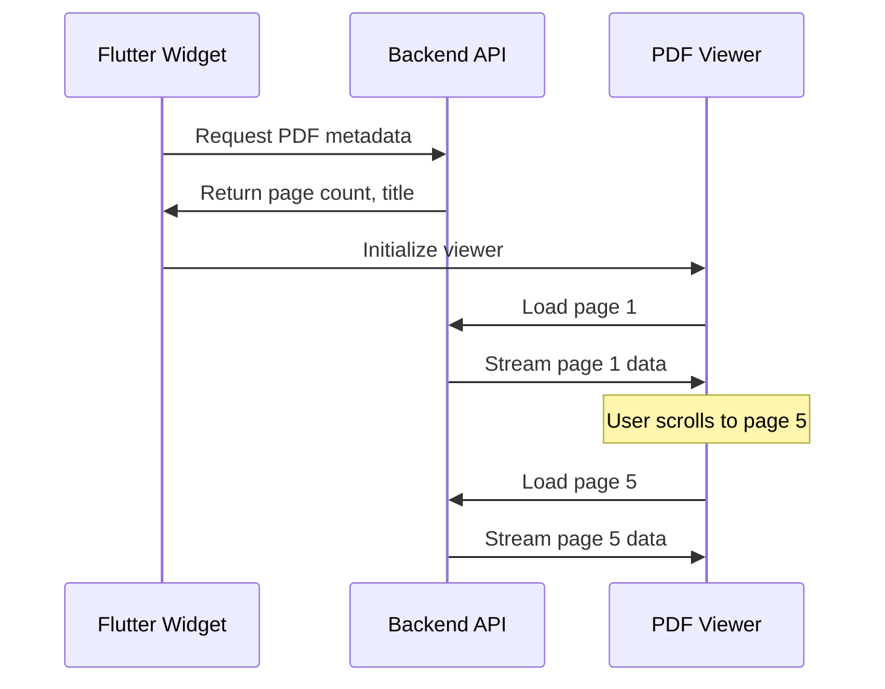

# Flutter PDF Page Streamer

A high-performance Flutter package for page-based PDF streaming, providing seamless PDF viewing for large documents by streaming individual pages instead of loading entire files.

[](https://pub.dev/packages/flutter_pdf_page_streamer)
[](https://flutter.dev)

## 🚀 **Why Page-Based Streaming?**

Traditional PDF viewers load entire documents into memory, causing performance issues with large files. **Flutter PDF Page Streamer** revolutionizes PDF viewing by loading only the pages you need, when you need them.

### **Performance Benefits**

| Feature | Traditional PDF Viewer | Flutter PDF Page Streamer |
|---------|------------------------|----------------------------|
| **Initial Load Time** | 10-30 seconds for 100MB PDF | 2-3 seconds |
| **Memory Usage** | Full PDF size in memory | ~5-10MB regardless of PDF size |
| **Network Transfer** | Download entire PDF first | Stream pages on-demand |
| **User Experience** | Long loading, then smooth | Instant start, continuous streaming |

### **Real-World Impact**

- **100MB Technical Manual**: Loads in 2 seconds vs 25 seconds
- **500-page Report**: Uses 8MB memory vs 150MB memory
- **Network Efficiency**: Only loads viewed pages, saving bandwidth
- **Mobile Performance**: Excellent performance even on low-end devices

## 📱 **Quick Start**

### Installation

Add to your `pubspec.yaml`:

```yaml
dependencies:
  flutter_pdf_page_streamer: ^0.1.0
```

### Basic Usage

```dart
import 'package:flutter_pdf_page_streamer/flutter_pdf_page_streamer.dart';

class MyPdfViewer extends StatelessWidget {
  @override
  Widget build(BuildContext context) {
    return Scaffold(
      appBar: AppBar(title: Text('PDF Viewer')),
      body: PdfStreamerWidget(
        config: PdfConfig.development(
          pdfId: 'my-document-id',
          backendUrl: 'http://localhost:3000/api/pdf',
          cdnUrl: 'http://localhost:3002',
        ),
        eventListeners: PdfEventListeners(
          onPdfLoaded: (event) => print('PDF loaded: ${event.pageCount} pages'),
          onPageChanged: (event) => print('Page ${event.currentPage}/${event.totalPages}'),
          onError: (event) => print('Error: ${event.message}'),
        ),
      ),
    );
  }
}
```

## 🏗️ **Architecture**

Flutter PDF Page Streamer follows the **Syncfusion Flutter PDF Viewer** architectural pattern:

```
Flutter Widget → Platform Channels → JavaScript PDF Viewer → Backend API
```

### **Key Components**

1. **PdfStreamerWidget**: Main Flutter widget for PDF viewing
2. **Platform Channels**: Bridge between Flutter and JavaScript (MethodChannel + EventChannel)
3. **CDN Manager**: Loads PDF viewer assets from CDN
4. **Page Streaming**: Loads individual pages via `:id/page` endpoints

### **Page-Based Streaming Flow**



## 🔧 **Configuration**

### **Development Configuration**

```dart
final config = PdfConfig.development(
  pdfId: 'document-id',
  backendUrl: 'http://localhost:3000/api/pdf',
  cdnUrl: 'http://localhost:3002',
  initialPage: 1,
  initialZoom: 1.0,
);
```

### **Production Configuration**

```dart
final config = PdfConfig.production(
  pdfId: 'document-id',
  backendUrl: 'https://api.yourapp.com/pdf',
  cdnUrl: 'https://cdn.yourapp.com/pdf-viewer',
  fallbackCdnUrls: [
    'https://backup-cdn.yourapp.com/pdf-viewer'
  ],
  enablePagePreloading: true,
  preloadBuffer: 3,
);
```

### **Local Assets Configuration**

For applications that want to bundle PDF viewer assets with the Flutter web app (same directory as index.html):

```dart
PdfStreamerWidget(
  config: PdfConfig.local(
    pdfId: 'my-document',
    backendUrl: 'https://api.myapp.com/pdf',
    assetsPath: 'assets', // Relative to index.html
    debugMode: false,
  ),
  // ... event listeners
)
```

**Directory Structure for Local Assets:**
```
web/
├── index.html
├── assets/
│   ├── pdf-viewer.css
│   └── pdf-viewer.js
└── ... other web files
```

This approach is perfect when you want to:
- 📦 Bundle assets with your app for offline usage
- 🔒 Avoid external CDN dependencies
- ⚡ Ensure fastest possible asset loading
- 🛠️ Have full control over asset versions

**Setup Steps for Local Assets:**

1. **Copy PDF viewer files to your Flutter web directory:**
   ```bash
   # Copy from html_core build output
   cp html_core/dist/pdf-viewer.css web/assets/
   cp html_core/dist/pdf-viewer.js web/assets/
   ```

2. **Use the local configuration in your Flutter app:**
   ```dart
   PdfStreamerWidget(
     config: PdfConfig.local(
       pdfId: 'my-document',
       backendUrl: 'https://api.myapp.com/pdf',
       assetsPath: 'assets', // Points to web/assets/
     ),
   )
   ```

3. **Deploy with your Flutter web app** - assets are automatically included!

### **Configuration Options**

| Option | Description | Default |
|--------|-------------|---------|
| `pdfId` | Unique identifier for the PDF | Required |
| `backendUrl` | Backend API URL for page streaming | Required |
| `cdnUrl` | CDN URL for PDF viewer assets | Required |
| `initialPage` | Starting page number (1-indexed) | 1 |
| `initialZoom` | Initial zoom level | 1.0 |
| `enablePagePreloading` | Preload adjacent pages | true |
| `preloadBuffer` | Number of pages to preload | 2 |
| `maxConcurrentPageLoads` | Concurrent page requests | 3 |
| `cacheSize` | Maximum pages in cache | 50 |

## 📡 **Event Handling**

### **Complete Event Listener Setup**

```dart
PdfStreamerWidget(
  config: config,
  eventListeners: PdfEventListeners(
    onPdfLoaded: (event) {
      print('PDF loaded: ${event.pdfId}');
      print('Total pages: ${event.pageCount}');
      print('Title: ${event.title}');
    },
    onPageChanged: (event) {
      print('Current page: ${event.currentPage}/${event.totalPages}');
      print('Progress: ${(event.progress * 100).toStringAsFixed(1)}%');
    },
    onZoomChanged: (event) {
      print('Zoom level: ${event.zoomPercentage}%');
    },
    onLoadingStateChanged: (event) {
      if (event.isLoading) {
        print('Loading: ${event.progressPercentage}%');
      }
    },
    onError: (event) {
      print('Error ${event.code}: ${event.message}');
      if (event.recoverable) {
        // Handle recoverable errors
      }
    },
    onPageLoaded: (event) {
      print('Page ${event.pageNumber} loaded in ${event.loadTime.inMilliseconds}ms');
    },
  ),
)
```

### **Available Events**

- **PdfLoadedEvent**: PDF document loaded successfully
- **PageChangedEvent**: User navigated to different page
- **ZoomChangedEvent**: Zoom level changed
- **LoadingStateChangedEvent**: Loading progress updates
- **PdfErrorEvent**: Error occurred during operation
- **PageLoadedEvent**: Individual page loaded (streaming-specific)
- **PagePreloadEvent**: Page preloading status updates

## 🎮 **Widget Control**

### **Programmatic Control**

```dart
class PdfController extends StatefulWidget {
  @override
  _PdfControllerState createState() => _PdfControllerState();
}

class _PdfControllerState extends State<PdfController> {
  final GlobalKey<_PdfStreamerWidgetState> _pdfKey = GlobalKey();

  @override
  Widget build(BuildContext context) {
    return Column(
      children: [
        Row(
          children: [
            ElevatedButton(
              onPressed: () => _pdfKey.currentState?.goToPage(1),
              child: Text('First Page'),
            ),
            ElevatedButton(
              onPressed: () => _pdfKey.currentState?.setZoom(1.5),
              child: Text('Zoom 150%'),
            ),
          ],
        ),
        Expanded(
          child: PdfStreamerWidget(
            key: _pdfKey,
            config: config,
          ),
        ),
      ],
    );
  }
}
```

### **Available Control Methods**

```dart
// Navigation
await pdfWidget.goToPage(pageNumber);

// Zoom control
await pdfWidget.setZoom(1.5); // 150% zoom

// State queries
final currentPage = await pdfWidget.getCurrentPage();
final totalPages = await pdfWidget.getPageCount();
```

## 🛠️ **Backend Integration**

### **Required Backend Endpoints**

Your backend must implement these endpoints for page-based streaming:

```typescript
// Get PDF metadata
GET /:id/info
Response: { pageCount: number, title: string }

// Get specific page
GET /:id/page/:pageNumber
Response: Page image data (PNG/JPEG) or PDF page data
```

### **Example Backend Implementation (Node.js)**

```typescript
import express from 'express';

const app = express();

// PDF metadata endpoint
app.get('/api/pdf/:id/info', async (req, res) => {
  const { id } = req.params;
  const metadata = await getPdfMetadata(id);
  res.json({
    pageCount: metadata.pageCount,
    title: metadata.title
  });
});

// Page streaming endpoint
app.get('/api/pdf/:id/page/:pageNumber', async (req, res) => {
  const { id, pageNumber } = req.params;
  const pageData = await renderPdfPage(id, parseInt(pageNumber));

  res.setHeader('Content-Type', 'image/png');
  res.setHeader('Cache-Control', 'public, max-age=3600');
  res.send(pageData);
});
```

## 🎨 **Customization**

### **Custom Error Display**

```dart
PdfStreamerWidget(
  config: config,
  errorBuilder: (context, error) {
    return Container(
      padding: EdgeInsets.all(20),
      child: Column(
        mainAxisAlignment: MainAxisAlignment.center,
        children: [
          Icon(Icons.error_outline, size: 64, color: Colors.red),
          SizedBox(height: 16),
          Text('Failed to load PDF', style: TextStyle(fontSize: 18)),
          Text(error.message),
          SizedBox(height: 16),
          ElevatedButton(
            onPressed: () => Navigator.of(context).pop(),
            child: Text('Go Back'),
          ),
        ],
      ),
    );
  },
)
```

### **Custom Loading Display**

```dart
PdfStreamerWidget(
  config: config,
  loadingBuilder: (context, loadingState) {
    return Container(
      child: Column(
        mainAxisAlignment: MainAxisAlignment.center,
        children: [
          CircularProgressIndicator(value: loadingState.progress),
          SizedBox(height: 16),
          Text('Loading page ${loadingState.pageNumber ?? ""}...'),
          Text('${loadingState.progressPercentage}% complete'),
        ],
      ),
    );
  },
)
```

## 🔧 **Advanced Usage**

### **Multiple PDF Viewers**

```dart
class MultiPdfViewer extends StatelessWidget {
  @override
  Widget build(BuildContext context) {
    return PageView(
      children: [
        PdfStreamerWidget(
          config: PdfConfig.production(
            pdfId: 'document-1',
            backendUrl: 'https://api.yourapp.com/pdf',
            cdnUrl: 'https://cdn.yourapp.com/pdf-viewer',
          ),
        ),
        PdfStreamerWidget(
          config: PdfConfig.production(
            pdfId: 'document-2',
            backendUrl: 'https://api.yourapp.com/pdf',
            cdnUrl: 'https://cdn.yourapp.com/pdf-viewer',
          ),
        ),
      ],
    );
  }
}
```

### **Performance Optimization**

```dart
// High-performance configuration for large documents
final optimizedConfig = PdfConfig.production(
  pdfId: 'large-document',
  backendUrl: 'https://api.yourapp.com/pdf',
  cdnUrl: 'https://cdn.yourapp.com/pdf-viewer',
  enablePagePreloading: true,
  preloadBuffer: 5,           // Preload more pages
  maxConcurrentPageLoads: 8,  // More concurrent requests
  cacheSize: 200,             // Larger cache
);
```

## 📊 **Performance Monitoring**

### **Track Loading Performance**

```dart
PdfEventListeners(
  onPageLoaded: (event) {
    // Monitor page load times
    analytics.track('page_loaded', {
      'page_number': event.pageNumber,
      'load_time_ms': event.loadTime.inMilliseconds,
      'from_cache': event.fromCache,
    });
  },
  onLoadingStateChanged: (event) {
    // Monitor overall loading progress
    if (!event.isLoading) {
      analytics.track('pdf_load_complete');
    }
  },
)
```

## 🐛 **Troubleshooting**

### **Common Issues**

#### **"Failed to load PDF viewer assets"**
- **Cause**: CDN assets not accessible
- **Solution**: Check CDN URL, verify CORS settings, try fallback URLs

#### **"Backend URL must be a valid absolute URL"**
- **Cause**: Invalid backend URL format
- **Solution**: Use complete URLs like `https://api.yourapp.com/pdf`

#### **Pages loading slowly**
- **Cause**: Backend performance or network issues
- **Solution**: Optimize backend caching, use CDN for assets, increase `maxConcurrentPageLoads`

### **Debug Mode**

```dart
final debugConfig = PdfConfig.development(
  pdfId: 'debug-document',
  debugMode: true, // Enables detailed logging
);
```

## 🔒 **Security Considerations**

### **Access Control**

```dart
// Example with authentication
final authenticatedConfig = PdfConfig.production(
  pdfId: 'secure-document',
  backendUrl: 'https://api.yourapp.com/pdf',
  cdnUrl: 'https://cdn.yourapp.com/pdf-viewer',
);

// Add authentication headers in your backend
app.get('/api/pdf/:id/page/:pageNumber', authenticateUser, async (req, res) => {
  // Verify user has access to this document
  if (!await userCanAccessDocument(req.user, req.params.id)) {
    return res.status(403).json({ error: 'Access denied' });
  }

  // Return page data
  const pageData = await renderPdfPage(req.params.id, parseInt(req.params.pageNumber));
  res.send(pageData);
});
```

## 📈 **Comparison with Other Solutions**

| Feature | flutter_pdf_page_streamer | syncfusion_flutter_pdfviewer | advance_pdf_viewer |
|---------|----------------------------|------------------------------|-------------------|
| **Page Streaming** | ✅ Built-in | ❌ Full document load | ❌ Full document load |
| **Memory Efficiency** | ✅ ~5-10MB constant | ❌ Full PDF size | ❌ Full PDF size |
| **Large File Support** | ✅ Excellent (500MB+) | ⚠️ Limited by memory | ⚠️ Limited by memory |
| **Network Efficiency** | ✅ Load on demand | ❌ Download entire file | ❌ Download entire file |
| **Flutter Web** | ✅ Optimized | ✅ Supported | ❌ Not supported |
| **Platform Channels** | ✅ Standard pattern | ✅ Standard pattern | ❌ Different approach |

## 🤝 **Contributing**

We welcome contributions! Please see our [Contributing Guide](CONTRIBUTING.md) for details.

### **Development Setup**

```bash
# Clone the repository
git clone https://github.com/alvinow/flutter_pdf_page_streamer.git

# Install dependencies
cd flutter_pdf_page_streamer
flutter pub get

# Run tests
flutter test

# Run example
cd example
flutter run -d chrome
```

## 📄 **License**

This project is licensed under the MIT License - see the [LICENSE](LICENSE) file for details.

## 🙏 **Acknowledgments**

- Inspired by the Syncfusion Flutter PDF Viewer architecture
- Built for high-performance PDF streaming use cases
- Designed for the PDF Page Streamer ecosystem

---

**Made with ❤️ for the Flutter community**

For more examples and documentation, visit our [GitHub repository](https://github.com/your-org/flutter_pdf_page_streamer).
